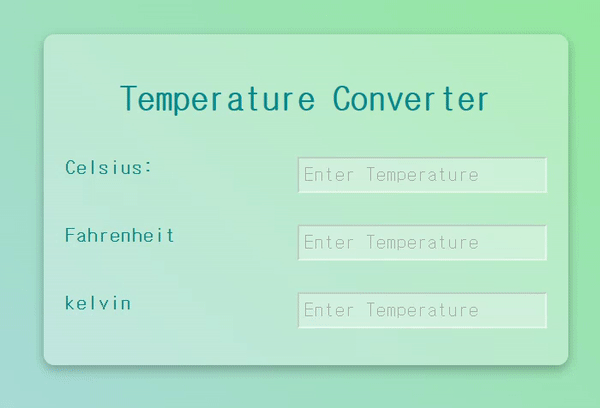

# Temperature-Converter


## 기능  
온도 변환기 

## 학습 
### 1. html : input과 label을 연결하면 생기는 이점   
- label 텍스트는 텍스트 입력과 시각적으로 관련이 있을뿐만 아니라 프로그래밍적으로도 관련이 있습니다. 예를 들어, 화면리더기(screenreader) 는 폼 입력(form input)에서 label 을 읽어서 보조기술(assistive technology) 사용자가 입력해야하는 텍스트가 무엇인지 더 쉽게 이해할 수 있게 합니다.
  
- 관련 label 을 클릭해서 input 자체에 초점을 맞추거나 활성화를 시킬 수 있습니다. (활성되어서)늘어난 누를 수 있는 영역(hit area)은 터치스크린 사용자를 포함해 입력하려하는 모든 사람에게 이점을 줍니다.

- 연결시키는 방법   
  
  1)     
      `<label>` 을 `<input>` 요소와 연관시키려면, `<input>` 에 id 속성을 넣어야합니다. 그런 다음 `<label>` 에 id 와 같은 값의 for 속성을 넣어야합니다.
   
      ```
      <label for="celsius">Celsius:</label>
          <input onchange="computeTemp(event)" type="number" name="celsius" class="input" id="celsius" placeholder="Enter Temperature">
      ```

  2) `<label>` 안에 `<input>` 을 중첩시킬 수 있습니다. 이 경우 연관이 암시적이므로 for 및 id속성이 필요없습니다.
      ```
      <label
        >Do you like peas?
        <input type="checkbox" name="peas" />
      </label>
      ```

### 2. JS : onchange Event  
HTML 요소의 값이 변경 되면 이벤트 onchange가 발생

*cf. oninput과 유사*   
이벤트|oninput|onchange|
---|---|---|
공통점|요소의 값이 변경되면 이벤트 발생|요소의 값이 변경되면 이벤트 발생
차이점|요소의 값이 변경된 직후에 발생|내용이 변경된 후 요소가 포커스를 잃었을 때 발생, `<select>` 요소에서도 작동

## 학습 출처
- 유튜브   
https://www.youtube.com/@JavaScriptKing 

- html  
https://developer.mozilla.org/ko/docs/Web/HTML/Element/label

- js   
https://www.w3schools.com/jsref/event_onchange.asp